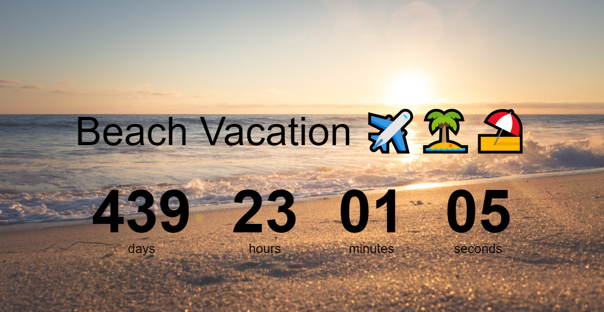

<h1>
    
</h1>

## Índice 🔍
- [Sobre](#-sobre)
- [Tecnologias utilizadas](#-tecnologias-utilizadas)
- [Guia completo](#-guia-completo)

---
## Sobre 📑

O projeto **Basic Countdown Timer** é uma aplicação básica que realiza uma contagem regressiva com base na data que o usuário coloca. Ademais, foi programado por **mim**, estudante em uma Empresa Júnior de Engenharia de Computação da Universidade Federal de Santa Catarina, baseado em um guia no Youtube.

---

## Tenologias utilizadas 📑

- HTML;
- CSS;
- JavaScript.

---

## Guia completo 📑

- Baseado nesse vídeo no [Youtube](https://www.youtube.com/watch?v=dtKciwk_si4&t=1s); 
- [Emojis](https://emojipedia.org/);
- [Banco de Imagens](https://www.pexels.com/pt-br/);
- [Cursor](https://www.cursors-4u.com/cursor/2008/12/22/world-of-warcraft-wow-hand-armor.html).

                                Desenvolvido por Pedro Craveiro 🌐
